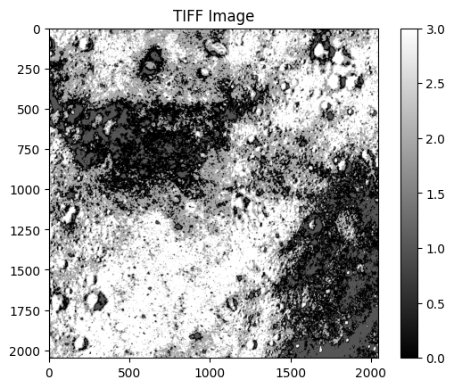
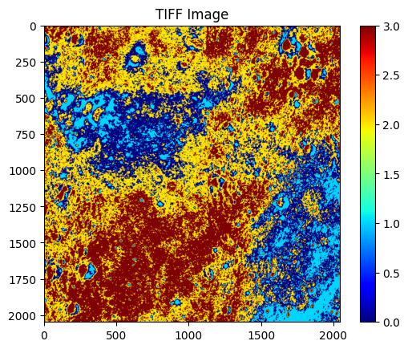

[](https://github.com/UdayLab/geoAnalytics/blob/main/LICENSE)


[](https://github.com/UdayLab/geoAnalytics/issues)
[](https://github.com/UdayLab/geoAnalytics/network)
[](https://github.com/UdayLab/geoAnalytics/stargazers)
[](https://geoanalytics.readthedocs.io/en/latest/?badge=latest)
[](https://pepy.tech/projects/geoanalytics)
[](https://pepy.tech/projects/geoanalytics)
[](https://pepy.tech/projects/geoanalytics)
[](https://github.com/UdayLab/geoAnalytics/actions/workflows/pages/pages-build-deployment)


[Click here for more information](https://pepy.tech/project/geoAnalytics)


***

# Table of Contents

- [Introduction](#introduction)
- [Development process](#process-flow-chart)
- [Inputs and outputs of a knowledge discovery algorithm](#inputs-and-outputs-of-an-algorithm-in-pami)
- [Recent updates](#recent-updates)
- [Features](#features)
- [Installing GDAL](#Installing-GDAL-Package)
- [Maintenance](#Maintenance)
- [Try your first geoAnalytics program](#try-your-first-geoAnalytics-program)
- [Reading Material](#Reading-Material)
- [License](#License)
- [Documentation](#Documentation) 
- [Getting Help](#Getting-Help)
- [Discussion and Development](#Discussion-and-Development)
- [Contribution to geoAnalytics](#Contribution-to-geoAnalytics)
- [Tutorials](#tutorials)
    - [Conversion](#0-Conversion)
    - [Imputation](#1-Imputation)
    - [Clustering](#2-Clustering)
    - [Pattern Mining](#3-Pattern-Mining)
- [Real-World Case Studies](#real-world-case-studies)


***
# Introduction

geoAnalytics is an open-source Python-based Machine Learning library developed to discover various forms of 
useful information hidden in the raster data. The algorithms provided in this library cover a wide-spectrum 
of machine learning tasks, such as imputation, image fusion, clustering, classification, one class 
classification, and pattern mining. This library being platform independent can run any operating system. 
Useful links to utilize the services of this library were provided below:

1. Youtube tutorial

2. Tutorials
   
3. User manual 

4. Coders manual  

5. Code documentation 

6. Datasets  

7. [Discussions](https://github.com/UdayLab/geoanalytics/discussions)

8. [Report issues](https://github.com/UdayLab/geoanalytics/issues)

***
# Flow Chart of Developing Algorithms in geoAnalytics


<!---  ---> 
***
# Inputs and Outputs of an Algorithm in geoAnalytics


***
# Recent Updates

- **Version 2025.06.04:** 
In this latest version, the following updates have been made:
  - Included thirteen new algorithms in imputation, **BackwardFill**, **ForwardFill**, **HotDeck**, **Interpolation**, **KNNImputation**, **MatrixFactorization**, **MeanImputation**, **MedianImputation**, **MICEImputation**, **ModeImputation**, **MultipleImputation**, **NumberImputation**, and **SoftImputation** for filling nan values.
  - Test cases are implemented using geoanalytics package.
Total number of algorithms: 30+
***
# Features

- ✅ Tested to the best of our possibility
- 🔋 Highly optimized to our best effort, light-weight, and energy-efficient
- 👀 Proper code documentation
- 🍼 Sample examples of using various algorithms at [./tests](https://github.com/UdayLab/geoanalytics/tree/main/tests) folder
- 🤖 Works with AI libraries such as TensorFlow, PyTorch, and sklearn. 
- ⚡️ Supports Cuda 
- 🖥️ Operating System Independence
- 🔬 Knowledge discovery in static data and streams
- 🐎 Snappy
- 🐻 Ease of use

***
# Installing GDAL Package
`GDAL` is an important toolkit in our library. It is for converting the raster data in any format into a human readable text or CSV format.
We have present the methods to install this toolkit using Conda environment on a machine running Ubuntu operating system.


    sudo apt-get update && sudo apt upgrade -y && sudo apt autoremove

    sudo apt-get install -y cdo nco gdal-bin libgdal-dev
    
    
    pip install --global-option=build_ext --global-option="-I/usr/include/gdal" GDAL==`gdal-config --version`


    python -m pip install --upgrade pip setuptools wheel
    python -m pip install --upgrade gdal 

If the above two commands have failed to install gdal, then execute the following commands:

    conda install -c conda-forge libgdal
    conda install -c conda-forge gdal
    conda install tiledb=2.2
    conda install poppler

Once the above commands were executed, check the version information by typing the following command on the `terminal`:

    ogrinfo --version

***
# Maintenance

  __Installation__


         pip install geoAnalytics


  __Upgradation__

  
        pip install --upgrade geoAnalytics
  

  __Uninstallation__

  
        pip uninstall geoAnalytics 
       

  __Information__ 


        pip show geoAnalytics

***
# *Try your first geoAnalytics program*

```shell
$ python
```
### _Install the Necessary Ubuntu Packages_
```shell
$ !apt update
```
```shell
$ !apt install -y nco cdo gdal-bin
```
```shell
$ !which ncrename
```
```
Output: /usr/bin/ncrename
```
```shell
$ !which cdo
```
```
Output: /usr/bin/cdo
```
```shell
$ !which gdal_translate
```
```
Output: /usr/bin/gdal_translate
```
### _Install the geoAnalytics package_
```python 
!pip install -U geoanalytics
```
### _Knowing the information of geoAnalytics package_
```python 
pip show geoanalytics
```
```
Output: 
        Name: geoanalytics
        Version: 2025.6.10.3
        Summary: This software is being developed at the University of Aizu, Aizu-Wakamatsu, Fukushima, Japan
        Home-page: https://github.com/UdayLab/geoanalytics
        Author: 
        Author-email: Rage Uday Kiran <uday.rage@gmail.com>
        License: GPLv3
        Location: /usr/local/lib/python3.11/dist-packages
        Requires: deprecated, discord.py, fastparquet, matplotlib, mplcursors, networkx, numba, numpy, pandas, Pillow, plotly, psutil, psycopg2-binary, resource, scikit-learn, shapely, sphinx, sphinx-rtd-theme, tqdm, urllib3, validators
        Required-by: 
```

### _Download any dataset with extension of both `.img` and `.lbl` from the below link_

#### _Link_ --> https://data.darts.isas.jaxa.jp/pub/pds3/sln-l-mi-5-map-v3.0/

#### _Example Direction :_ --> https://data.darts.isas.jaxa.jp/pub/pds3/sln-l-mi-5-map-v3.0/lon042/data/

#### _Upload the `.lbl` file `.img` file_

## **Operatioin 1: Raster to CSV**
### **_Step1: Import RasterToTSV package from geoAnalytics.conversion_**
```python 
from geoanalytics.conversion import Raster2CSV
```
### **_Step2: Pass the ``lbl`` file as input and give desired `outputFile` name also specify the `inputBand` value as well as `ouputBand` value_**
```python 
converter = Raster2CSV.Raster2CSV(inputFile='MI_MAP_03_S16E035S17E036SC.lbl', outputFile='Moon.csv', startBand=1, endBand=9)
```
### **_Step3: Convert the raster file into a CSV file_**
```python 
converter.run()
```
```
Output: 
        Processing: MI_MAP_03_S16E035S17E036SC.lbl
        Done. Output saved to: Moon.csv
```


## **Operation 2 : Clustering the Data**


### **_Step 1.1: Read the obtained CSV into a dataframe_**
```python 
import pandas as pd
df = pd.read_csv('Moon.csv', sep='\t')
df
```
| x           | y           | 1    | 2    | 3    | 4    | 5    | 6    | 7    | 8    | 9    |
|-------------|-------------|------|------|------|------|------|------|------|------|------|
| 1061317.265 | -485173.607 | 1928 | 3446 | 3859 | 3913 | 4026 | 3999 | 4236 | 5245 | 6513 |
| 1061332.071 | -485173.607 | 1924 | 3480 | 3876 | 3930 | 4059 | 3996 | 4243 | 5234 | 6518 |
| 1061346.877 | -485173.607 | 1904 | 3476 | 3834 | 3923 | 4047 | 3992 | 4238 | 5222 | 6523 |
| 1061361.684 | -485173.607 | 1874 | 3452 | 3801 | 3897 | 3959 | 3988 | 4228 | 5210 | 6518 |
| 1061376.490 | -485173.607 | 1907 | 3464 | 3777 | 3868 | 3974 | 3983 | 4218 | 5198 | 6504 |
| ...         | ...         | ...  | ...  | ...  | ...  | ...  | ...  | ...  | ...  | ...  |
| 1091566.583 | -515482.151 | 2090 | 3719 | 4007 | 3996 | 4117 | 4056 | 4310 | 5374 | 6633 |
| 1091581.390 | -515482.151 | 2098 | 3734 | 4038 | 4020 | 4177 | 4083 | 4327 | 5389 | 6659 |
| 1091596.196 | -515482.151 | 2114 | 3767 | 4046 | 4040 | 4213 | 4110 | 4332 | 5393 | 6685 |
| 1091611.002 | -515482.151 | 2123 | 3813 | 4019 | 4056 | 4214 | 4136 | 4331 | 5397 | 6711 |
| 1091625.809 | -515482.151 | 2125 | 3784 | 4011 | 4051 | 4184 | 4136 | 4329 | 5402 | 6737 |
`4194304 rows × 11 columns`

### **_Step2: Import any clustering algorithm from geoanalytics.clustering_**
```python 
!pip install fuzzy-c-means
from geoanalytics.clustering import FuzzyCMeans
obj = FuzzyCMeans.FuzzyCMeans(dataframe=df)
```
### **_Step3: Execute the run() method to cluster the data_**
```python 
labels, centers = obj.run(n_clusters=4)
```
### **_Step4: Print the labels_**
```python 
labels
```
| x           | y           | labels |
|-------------|-------------|--------|
| 1061317.265 | -485173.607 | 2      |
| 1061332.071 | -485173.607 | 2      |
| 1061346.877 | -485173.607 | 2      |
| 1061361.684 | -485173.607 | 2      |
| 1061376.490 | -485173.607 | 2      |
| ...         | ...         | ...    |
| 1091566.583 | -515482.151 | 2      |
| 1091581.390 | -515482.151 | 0      |
| 1091596.196 | -515482.151 | 0      |
| 1091611.002 | -515482.151 | 0      |
| 1091625.809 | -515482.151 | 0      |
4194304 rows × 3 columns

### **_Step5: Print the centers_**
```python 
centers
```
```
Output: 
      array([[2098.51620472, 3762.45416178, 4099.00372289, 4146.23025903,
              4295.80971825, 4229.78337628, 4443.6879668 , 5471.85298977,
              6790.96720993],
             [2274.54605523, 4040.75198398, 4374.89922669, 4395.57058102,
              4538.50885801, 4454.45212911, 4677.95182781, 5739.96854105,
              7095.06428559],
             [1984.82196498, 3578.0340764 , 3908.79548852, 3961.66894715,
              4108.90409919, 4049.30456217, 4255.81099407, 5258.24055464,
              6549.13133772],
             [1896.71176664, 3421.42972113, 3741.56611478, 3802.88625245,
              3946.94784255, 3896.3217178 , 4093.18671711, 5066.07543066,
              6327.35005223]])
```
### **_Step6: To know the run time and memory consumption of Algorithm, print the statistical values_**
```python 
obj.getRuntime()
obj.getMemoryRSS()
obj.getMemoryUSS()
```
```
Output: 
      Total Execution time of proposed Algorithm: 407.7022657394409 seconds
      Memory (RSS) of proposed Algorithm in KB: 1655512.0
      Memory (USS) of proposed Algorithm in KB: 1634900.0
```
### **_Step7: Save the labels and centers_**
```python 
obj.save(outputFileLabels='FuzzyCMeansLabels.csv', outputFileCenters='FuzzyCMeansCenters.csv')
```
```
Output: 
      Labels saved to: FuzzyCMeansLabels.csv
      Cluster centers saved to: FuzzyCMeansCenters.csv
```
## **Operation3: CSV to Raster**
### **_Step1: Import CSV2Raster from geoanalytics.conversion_**
```python 
from geoanalytics.conversion import CSV2Raster as CSV2Raster
```
### **_Step2: Pass the dataFrame and give desired outputFile name_**
```python 
process = CSV2Raster.CSV2Raster(dataframe=labels,outputFile='FuzzyCMeans.tiff')
```
### **_Step3: Execute the run() method_**
```python 
process.run()
```
```
Output: 
      (0, '')
      (139, 'Segmentation fault (core dumped)')
      (0, '')
      (0, 'Input file size is 2048, 2048\n0...10...20...30...40...50...60...70...80...90...100 - done.')
      (0, '')
```
## **Operation 4: Visualization**
### **_Step1: Import TiffViewer from geoanalytics.visualization_**
```python 
pip install rasterio
from geoanalytics.visualization import TiffViewer
```
### **_Step2: Input the RasterFile or pass it into the parameter_**
```python 
viewer = TiffViewer.TiffViewer(inputFile='FuzzyCMeans.tiff')
```
### **_Step3: Display the image with desired scaling map_**
###### **_1. gray scale_**
```python 
viewer.run(cmap='gray', title='TIFF Image')
```

###### **_2. Jet Scale_**
```python 
viewer.run(cmap='jet', title='TIFF Image')
```

***
# License

[](https://github.com/UdayLab/PAMI/blob/main/LICENSE)
***

# Documentation

The official documentation is hosted on [geoAnalytics](https://geoanalytics.readthedocs.io/en/latest/).
***
# Getting Help    

For any queries, the best place to go to is Github Issues [Github Issues](https://github.com/orgs/UdayLab/discussions/categories/q-a).

***
# Discussion and Development

In our GitHub repository, the primary platform for discussing development-related matters is the university lab. We encourage our team members and contributors to utilize this platform for a wide range of discussions, including bug reports, feature requests, design decisions, and implementation details.

***
# Contribution to geoAnalytics

We invite and encourage all community members to contribute, report bugs, fix bugs, enhance documentation, propose improvements, and share their creative ideas.

***
# Tutorials
### 0. Conversion

| Conversion                                                                                                                                                                                                                     |
|--------------------------------------------------------------------------------------------------------------------------------------------------------------------------------------------------------------------------------|
| CSV To Raster <a target="_blank" href="https://github.com/UdayLab/geoanalytics/blob/main/tests/conversion/test_CSV2Raster.ipynb"></a> |
| Raster To CSV <a target="_blank" href="https://github.com/UdayLab/geoanalytics/blob/main/tests/conversion/test_Raster2CSV.ipynb"></a> |

### 1. Imputation

| Imputation                                                                                                                                                                                                                               |
|------------------------------------------------------------------------------------------------------------------------------------------------------------------------------------------------------------------------------------------|
| Backward Fill <a target="_blank" href="https://github.com/UdayLab/geoanalytics/blob/main/tests/Imputation/test_BackwardFill.ipynb"></a>         |
| Forward Fill <a target="_blank" href="https://github.com/UdayLab/geoanalytics/blob/main/tests/Imputation/test_ForwardFill.ipynb"></a>           |
| Interpolation <a target="_blank" href="https://github.com/UdayLab/geoanalytics/blob/main/tests/Imputation/test_Interpolation.ipynb"></a>        |
| Mean Imputation <a target="_blank" href="https://github.com/UdayLab/geoanalytics/blob/main/tests/Imputation/test_MeanImputation.ipynb"></a>     |
| Median Imputation <a target="_blank" href="https://github.com/UdayLab/geoanalytics/blob/main/tests/Imputation/test_MedianImputation.ipynb"></a> |
| Mode Imputation <a target="_blank" href="https://github.com/UdayLab/geoanalytics/blob/main/tests/Imputation/test_ModeImputation.ipynb"></a>     |
| Number Imputation <a target="_blank" href="https://github.com/UdayLab/geoanalytics/blob/main/tests/Imputation/test_NumberImputation.ipynb"></a> |
| Soft Imputation <a target="_blank" href="https://github.com/UdayLab/geoanalytics/blob/main/tests/Imputation/test_SoftImputation.ipynb"></a>     |

### 2. Clustering

| Clustering                                                                                                                                                                                                                                           |
|------------------------------------------------------------------------------------------------------------------------------------------------------------------------------------------------------------------------------------------------------|
| KMeans <a target="_blank" href="https://github.com/UdayLab/geoanalytics/blob/main/tests/clustering/test_KMeans.ipynb"></a>                                  |
| KMeansPP <a target="_blank" href="https://github.com/UdayLab/geoanalytics/blob/main/tests/clustering/test_KMeansPP.ipynb"></a>                              |
| MEANshift <a target="_blank" href="https://github.com/UdayLab/geoanalytics/blob/main/tests/clustering/test_MEANshift.ipynb"></a>                            |
| AffinityPropagation <a target="_blank" href="https://github.com/UdayLab/geoanalytics/blob/main/tests/clustering/test_AffinityPropagationWrapper.ipynb"></a> |
| Agglomerative <a target="_blank" href="https://github.com/UdayLab/geoanalytics/blob/main/tests/clustering/test_Agglomerative.ipynb"></a>                    |
| DBScan <a target="_blank" href="https://github.com/UdayLab/geoanalytics/blob/main/tests/clustering/test_DBScan.ipynb"></a>                                  |
| FuzzyCMeans <a target="_blank" href="https://github.com/UdayLab/geoanalytics/blob/main/tests/clustering/test_FuzzyCMeans.ipynb"></a>                        |
| Gaussianmixture <a target="_blank" href="https://github.com/UdayLab/geoanalytics/blob/main/tests/clustering/test_Gaussianmixture.ipynb"></a>                |
| HDBScan <a target="_blank" href="https://github.com/UdayLab/geoanalytics/blob/main/tests/clustering/test_HDBScan.ipynb"></a>                                |
| OpticsClustering <a target="_blank" href="https://github.com/UdayLab/geoanalytics/blob/main/tests/clustering/test_OpticsClustering.ipynb"></a>              |
| Spectral <a target="_blank" href="https://github.com/UdayLab/geoanalytics/blob/main/tests/clustering/test_Spectral.ipynb"></a>                              |

### 3. Pattern Mining

| Pattern Mining                                                                                                                                                                                                                                          |
|---------------------------------------------------------------------------------------------------------------------------------------------------------------------------------------------------------------------------------------------------------|
| Frequent Pattern Mining  <a target="_blank" href="https://github.com/UdayLab/geoanalytics/blob/main/tests/patternMining/test_FrequentPatternMining.ipynb"></a> |     


# Real World Case Studies

1. Lunar data analytics <a target="_blank" href="https://github.com/UdayLab/geoanalytics/blob/main/tests/caseStudy/LunarDataAnalytics.ipynb"> </a>


[Go to Top](#table-of-contents)

## Installation using Anaconda (geoanalytics package).

1. Install and set up Anaconda. URL:   https://linuxize.com/post/how-to-install-anaconda-on-centos-7
2. Create a virtual environment using conda. E.g., coda create --name geoAnalytics
3. Enter into virtual environment.  E.g., conda activate geoAnalytics
4. Install python.   E.g., conda install python
5. Install pycharm from the website
6. Open Pycharm and using VCS download the latest copy of geoAnalytics from GitHub
7. In the pycharm, add geoAnalytics as the interpreter
8. Open the terminal in pycharm, and execute the following command

          pip install mplcursors matplotlib sklearn pandas
          
